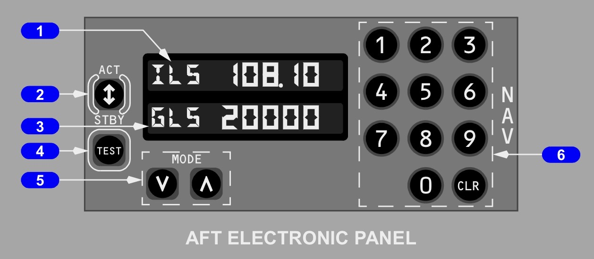
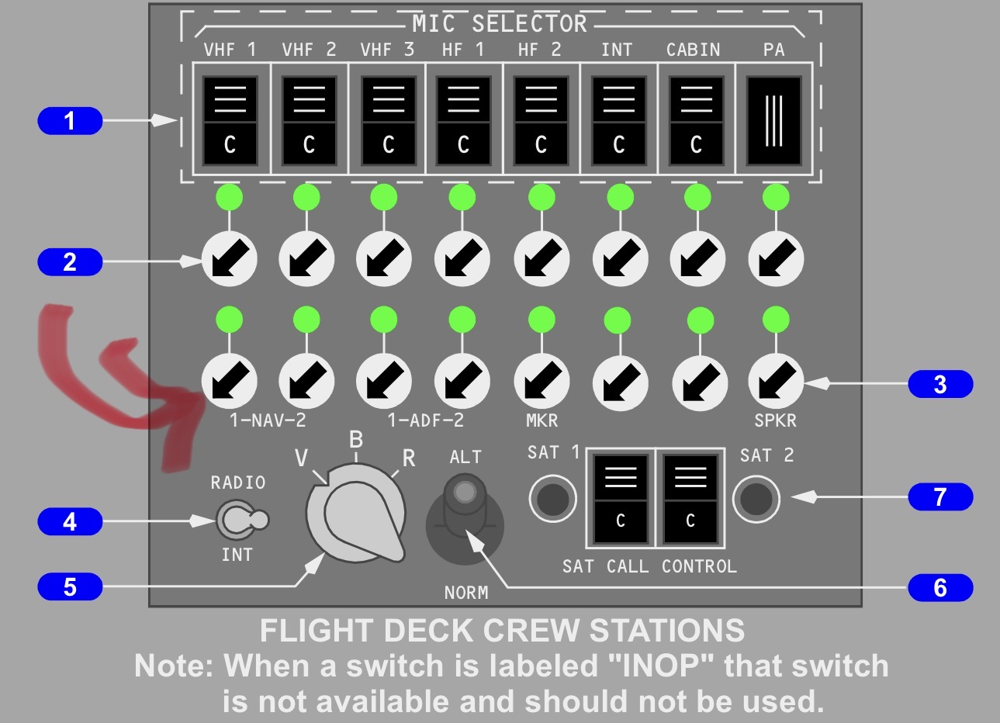

# ACC 🇬🇭   
**DGAA  - Accra, Ghana***   /  Kotoka International *  
**ET - 927 / 928**  
  
  
### ==INFO==  
> **==RW==**   21/ 03  
> 
> **==ELEV==**    205’  
> 
> **==UTC==**     +0  
> 
> **==CAT==**     A  
> 
> **==TL==**     040  
> 
> **==SID==**       BRO3A(07R) / BRO4B (25L)  
> 
> **==EXIT==**     BRO  
> 
> **==DEP==**   **EGBIM**  
  
### ==Info+==  
> STAR - - **==EREKA1B==** - AKMUS - ILS 21 / RNV 21  
> 
> Use NAV Panel to Copy ATIS   
> 
> Set V-B-R Selector on **==V==**  

    * Tune the VOR 113.1  
    * Then use NAV 1   
* Filter Switch to V (VOICE)  
>   
> 
>   
  
  
  
## ==ADD - ACC   (KAFIA - KITRA)==  
    * **==BRO==**  - - - **==JUBA INFO  127.9==**  - - - 🧑‍✈️ *“ ETH927 / FM ADD - ACC … “*  
            * - - - **==IATA 126.9==**  
    * **==KAFIA==**  - - - **==N’DJ  120.5==*** - - - 📻 “CALL PASSING **==NUROK==** / **==TJR==**" / “CHG **==NDJ 128.1==**”*  
    * **==GATAG==** - - - **==KAN 124.1==** - - - *📻 “DCT **==POLTO==”** / “ABEAM **==LUKRO==** **==LAG 127.3”==***  
    * **==LUKRO==**  - - - **==LAG 127.3==** * - - 📻 “LAGOS RAD CTC / DCT **==POLTO==”***  
    * **==POLTO==** - - - **==LOME 124.6==**  - - - *📻 "DCT **==KETAT”==***  
  
## ==ADD - ACC   (KAFIA - ONUDA)==  
    * **==ONUDA==** - - - **==BRZ  8903 / 127.1==** - - - 📻 *"DCT **==GADUV==** / CALL **==ABEAM BIDON==** ON **==VHF 127.1 ==**"*  
    * **==GADUV==**   - - - **==KANO 124.1==**   - - - *📻 " RAD CTC / DCT **==POLTO==** "*  
    * **==AKLIS==**  - - - **==LAG 127.3==** * - - 📻 “ RAD CTC / DCT **==POLTO==”***  
    * **==POLTO==** - - **==LOME 124.6==** - - - *📻 "DCT **==KETAT / AKMUS==**"*  
  
  
* Before **==LAG VOR==**  
* **==VHF 2: ==**LOME **==124.6==**  
        * *🧑‍✈️ “ETA POLTO & LM / DEST ACC / [FL380](x-apple-data-detectors://embedded-result/1081) / B737 / ET-AZA”*  
        * *📻 “RAD CTC / CALL POLTO”*  
        * *🧑‍✈️ “REQ MET REPORT”*  
        * *🧑‍✈️ “LAG [ET927](x-apple-data-detectors://embedded-result/1164) / TWO WAY WITH LOME”*  
  
* **==POLTO==** - - **==LOME 124.6==**  - - *“DCT **==KETAT”==***  
* **==TOD==**  - - **==LOME 124.6==**  - - - *“DESCENT [FL260](x-apple-data-detectors://embedded-result/1266)”*  
  
        * **==VHF 2==**  - - - **==ACC 130.9==**  - - Copy WX   
  
* **==[FL260](x-apple-data-detectors://embedded-result/1312)==** - - - ACC **==130.9==**    
    * 📻  “DCT **==ENOMA ( Not on Flight Plan) ==** / **==ENOMA - CONNECT IT WITH AKMUS==**  
            * (ILS21 / [FL160](x-apple-data-detectors://embedded-result/1415) / SPD230)   
    * **==RAD 119.5==**  -   
    * *📻 “ CTC **==TWR 118.6”==***  
    * **==TWR 118.6==** - - - *📻 "Taxi VIA A3-A - STAND C03"*  
  
  
  
  
  
  
  
## ==ACC - ADD==  
> ==TA==     3000’  
> 
> ==EO ALT==     1005’  
> 
> ==SID==    EREKA1D  
  
  
* **==TWR 118.6==**  
    * *“TAXI VIA- A - A2/A1  / HPRW21”*  
    * *“ CLR / [FL350](x-apple-data-detectors://embedded-result/1627) / **==ERIKA1D==** / SQ - “*  
* **==AFTER DEP==*** - - - 📻 “CTC ACC **==RAD==*****== 119.5==”**  
* **==RAD 119.5==*** - - - 📻 "CANCEL SID - CLB [FL350](x-apple-data-detectors://embedded-result/1728) - DCT **==TYE==** / CTC ***==CTRL 130.9==***”*  
* **==CTRL 130.9==*** - - - 📻 "DCT **==POLTO==*** / *“CTC ***==LOME 124.6==***”*  
  
* **==LM==** - - - **==LOME 124.6==*** - - - 📻 "RAD CTC / DCT **==POLTO==**”*  
* **==TYE==** - - -  **==LAG 127.3==** - - - *📻 “DCT **==GADUV==** / [FL350](x-apple-data-detectors://embedded-result/1907)”*  
* **==GADUV==** - - - **==BRAZA 8903 / 127.1 ==- - - ***📻 "DCT **==ASKON==**  ”*  
* **==ASKON==** **- - - ==JUBA 127.9==**  
* **==DASTU==**   **ADDIS** **BABY**  
