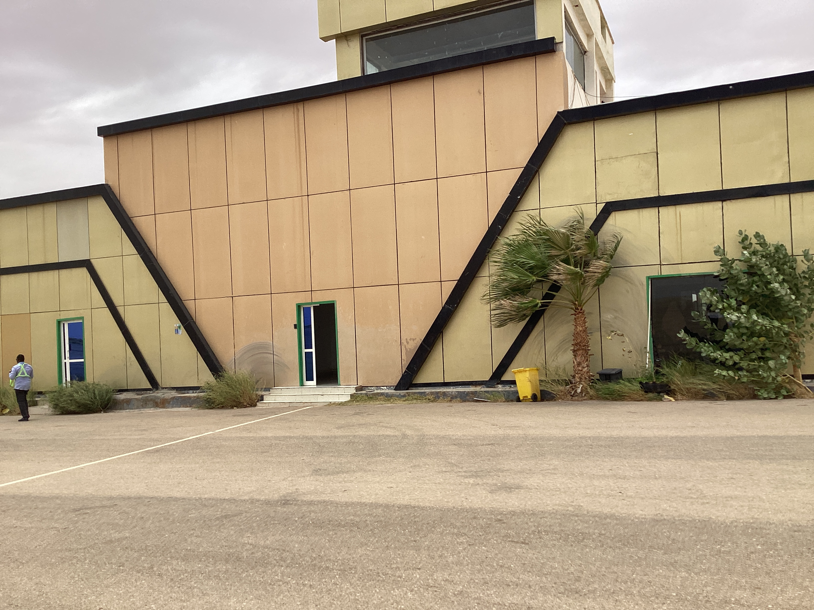
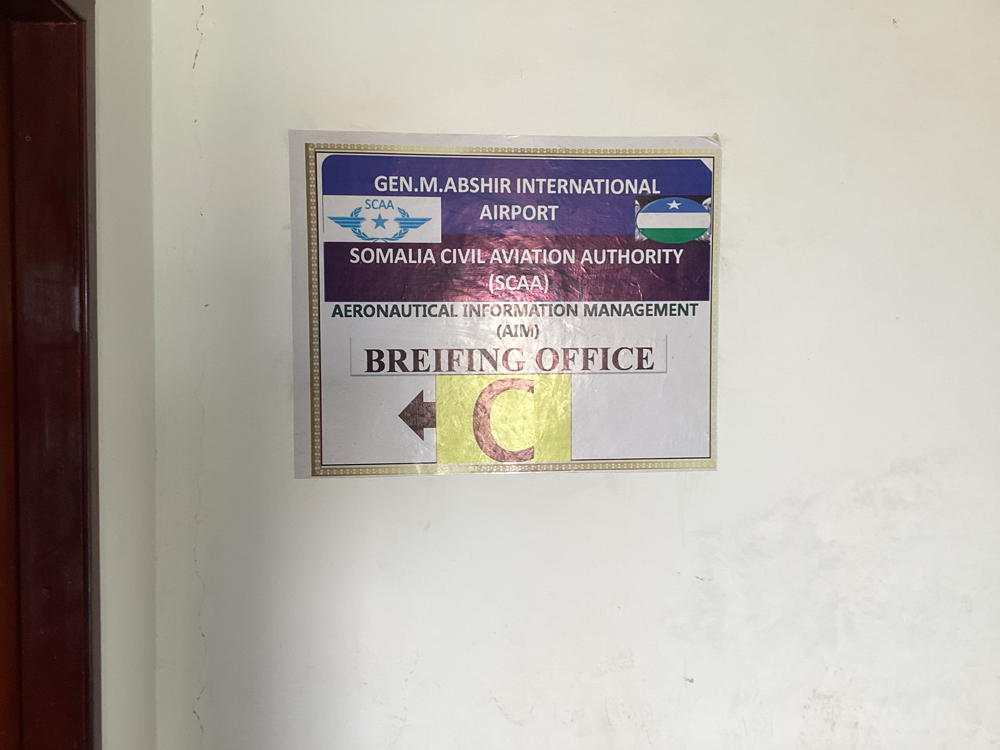
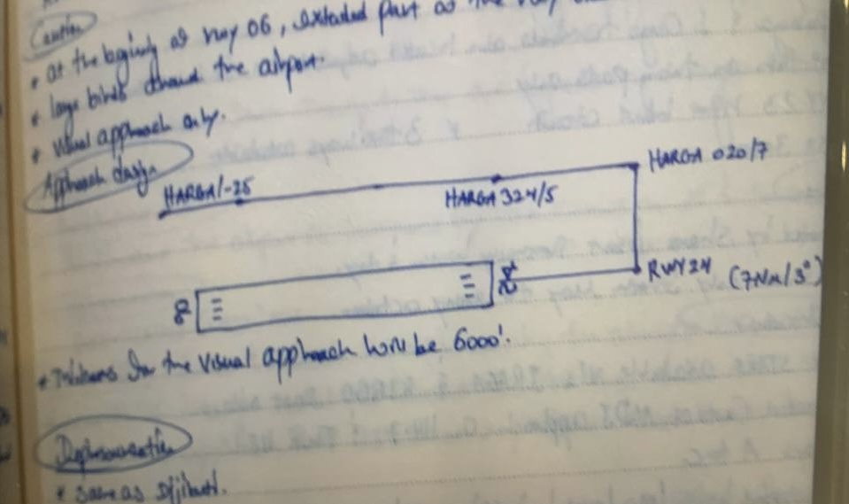
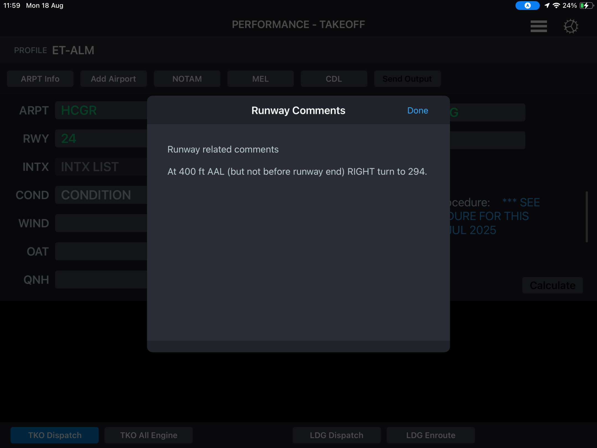

# GGR 🇸🇴  
**==HCGR==**  - GAROWE, SOMALIA   
**==368/9 ==**  
  
## ==INFO==  
> ==RW==   06 / 24  
> 
> ==ELEV==     1470’  
> 
> ==UTC==     +3  
> 
> ==CAT==  
> 
> ==ALT==    HAAB  
> 
> ==TL==     FL110  
> 
> ==SID==        MAGON1B (25L)  
> 
> ==EXIT==      ARSHI  
> 
> ==DEP==    ==ASOLE==  
  
  
### ==INFO +==  
> No Chart / It’s Visual  
> 
> Strong Headwind RW24 From July - September  
> 
> Flight plan submitted in person inside office  
> 
>   
> 
>   
  
**==For Planing Use the same FMC Preparation as Hargeisa ==**  
  
  
  
# ==ADD - GGR==  
* **==ARSHI:==**      **==MOGADISHU 132.5==** - - - 📻 *“Report TOD”*  
VHF2: **==HGA 118.7==*** - - - 📻 “Report **==MURAL==** / Two way With GGR TWR”*  
* **==200NM from GGR:==**    **==GGR TWR 118.4==**  - - - 📻* “ Report Right Base / Copy WX “*  
* **After Landing**: - - 📻* “Make 180 RW24 / to the Right / Report Marshaler insight”*  
  
  
  
  
# ==GGR - ADD==  
> **==E/O:==**  294° RIGHT TURN  
> 
> **==E/O:==**    2300’  

  
* **ATC - ***- - 📻  “ CLRD TO ADD / FPR / FL380 / RW24 / R TURN “*  
* **==MOGADISHU 132.5==*** - - - 📻  “ Report FL380”*  
    * VHF 2: - - **==HARGESA 118.7==** *- - - 📻  “ Report HARGA / FL380”*  
* **==ARSHI==**  - - -  **==ADDIS 125.2==**  
  
